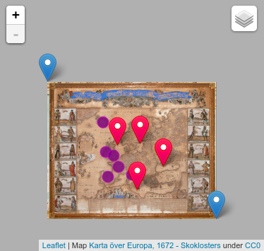

# gdal2tiles-leaflet

> Generate raster image tiles for use with leaflet.

[Example][example] in action.

This is a modified version of [gdal2tiles.py][] which adds support for raster images as plain 2D maps in [leafletjs][].

It adds the option `-l` or `--leaflet` to generate the resulting images with the reference point `[0,0]` in the upper-left (North-West) corner, opposed to the standard behaviour for TMS tiles using the lower-left (South-East) corner.

Together with the small [leafletjs][] plugin [leaflet-rastercoords][] you'll be able to add markers at the correct position using the (x, y) coordinates of the full-size image.

## Prerequisites

On Debian style OS:

    sudo apt install python-gdal

for others give your search-engine a try...

## Basic usage

````
$ gdal2tiles.py -l -p raster -z 0-5 -w none <image> <tilesdir>
````

Check [test/createtiles.sh](test/createtiles.sh) for usage.

If the `-z` option is omitted then the tool considers the min. zoom level otherwise note...

**Note:** The min zoom level for tile generation must be greater or
equal to `log2(max(width, height)/tilesize)`

Assuming an image with 2000x3000 pixels:

````
# take the larger dimension -> here height = 3000px
$ echo "l(3000/256)/l(2)" | bc -l
# 3.55 --> min zoomlevel for tile generation is 4
# means: `gdal2tiles.py -l -p raster -z 0-2 ...`
#                                          \__ is not allowed
# correct usage
$ gdal2tiles -l -p raster -z 0-4 ...
````

## Multicore usage

The same works with multicore support, thanks to [gdal2tiles-Ticket-4379][].

````
$ gdal2tiles-multiprocess.py -l -p raster -z 0-5 -w none <image> <tilesdir>
````

## Usage with Leaflet

To use the generated tiles with Leaflet there is a small plugin to correctly set the required projection for raster images.
Please refer to the documention at [leaflet-rastercoords][].

## Example

To run the example you'll need to generate the tiles for the large image first.

````
$ cd test
$ ./createtiles.sh
$ open index.html
````

Then open `index.html` in a browser.

[][example]

Or see it [here][example] in action.

## Contribution and License Agreement

If you contribute code to this project, you are implicitly allowing your
code to be distributed under the respective license. You are also implicitly
verifying that all code is your original work or correctly attributed
with the source of its origin and licence.

## License

Modifications and samples are [MIT licensed][LICENSE].

[gdal2tiles.py][]: (MIT licensed)
* Copyright (c) 2008, Klokan Petr Pridal
* Copyright (c) 2010-2013, Even Rouault

leaflet for sample: [(License)](https://github.com/Leaflet/Leaflet/blob/master/LICENSE)
* Copyright (c) 2010-2015, Vladimir Agafonkin
* Copyright (c) 2010-2011, CloudMade

## References

<!-- !ref -->

* [/gdal-1.11.1/swig/python/scripts/gdal2tiles.py][gdal2tiles.py]
* [example][example]
* [gdal2tiles-Ticket-4379][gdal2tiles-Ticket-4379]
* [leaflet-rastercoords][leaflet-rastercoords]
* [leafletjs][leafletjs]
* [LICENSE][LICENSE]

<!-- ref! -->

[LICENSE]: ./LICENSE
[leafletjs]: http://leafletjs.com
[leaflet-rastercoords]: https://github.com/commenthol/leaflet-rastercoords
[gdal2tiles.py]: http://download.osgeo.org/gdal/1.11.1/gdal-1.11.1.tar.gz "/gdal-1.11.1/swig/python/scripts/gdal2tiles.py"
[gdal2tiles-Ticket-4379]: http://trac.osgeo.org/gdal/ticket/4379
[example]: https://commenthol.github.io/leaflet-rastercoords/
